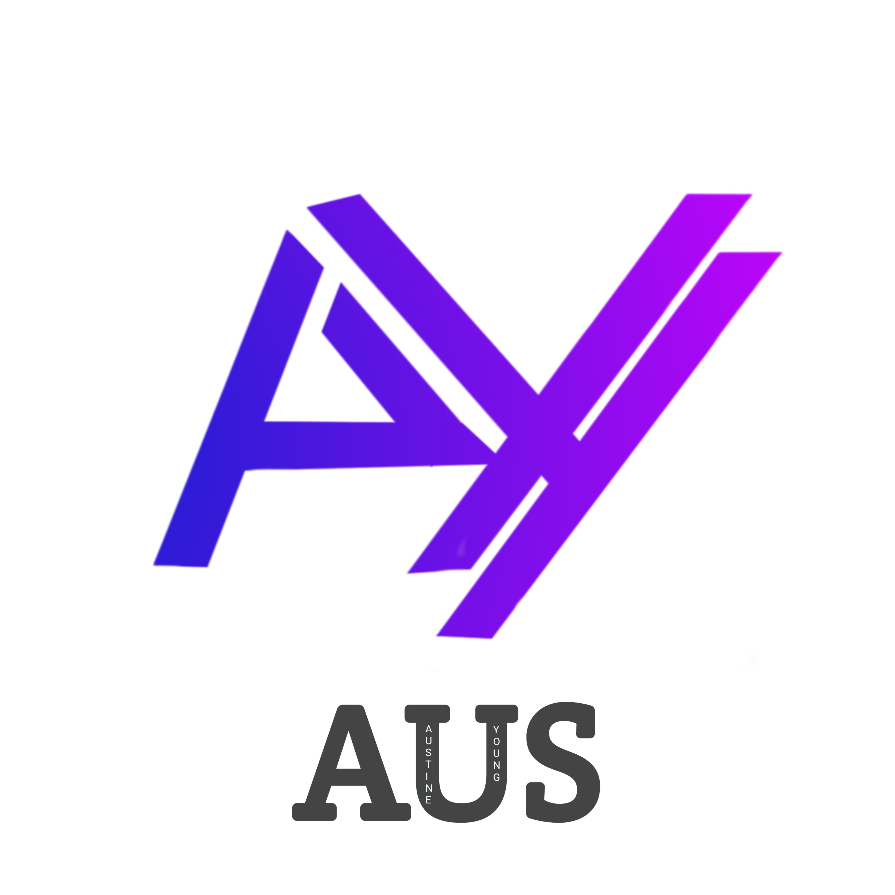

#  Nweze Augustine Chukwuka

---

<h2 align="center">  About Me</h2>

Passionate about creating visually stunning experiences, building modern interfaces, and turning ideas into digital reality.

Always learning, always building, always improving.

---

<h2 align="center">Connect With Me</h2>

---

<h2 align="center">

Tech Stack
</h2>

---

<h2 align="center">GitHub Analytics</h2>

---

<h2 align="center">GitHub Streak</h2>

---

<h2 align="center">

Activity Graph
</h2>

---

### ⚡ Building • Learning • Growing

<!--
**Austine-Young-coder/Austine-Young-coder** is a ✨ _special_ ✨ repository because its `README.md` (this file) appears on your GitHub profile.

Here are some ideas to get you started:

- 🔭 I’m currently working on ...
- 🌱 I’m currently learning ...
- 👯 I’m looking to collaborate on ...
- 🤔 I’m looking for help with ...
- 💬 Ask me about ...
- 📫 How to reach me: ...
- 😄 Pronouns: ...
- ⚡ Fun fact: ...
-->
